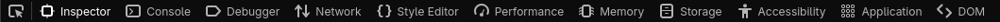
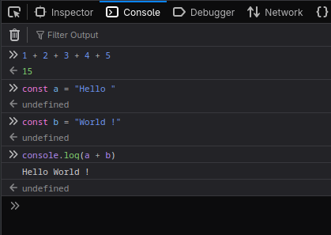

# Exercice 2

## Console JavaScript dans votre navigateur

Pour interagir avec le code JavaScript de votre navigateur, vous pouvez ouvrir l'inspecteur :

1. Allez sur la page que vous souhaitez analyser
2. Faites clic droit sur la page, sélectionnez "Inspecter"
3. Un nouveau panneau s'ouvre avec plusieurs onglets, par exemple sur Firefox :

Sur d'autres navigateurs les principaux onglets sont très similaires.

Les onglets :

- *Inspector* ou *Elements* : Affiche le code HTML de la page, le premier bouton dans la liste des onglets vous permet de sélectionner visuellement un éléments pour l'inspecter. Le code HTML s'ouvre alors jusqu'à l'élément sélectionné

- *Console* : Console JavaScript vous permettant d'executer du code directement dans la page web.

- *Network* : Durant le chargement de la page, affiche toutes les requêtes que votre navigateur fait pour récupérer des ressources distantes.

L'onglet qui nous intéresse ici est la *Console*. Elle permet d'entrer du code et de l'executer, de manière similaire à la console Python.

Les lignes avec `>>` indiquent une entrée utilisateur. Les lignes avec `⬅` indiquent la valeur renvoyée par l'execution de la ligne précédente.
Notez qu'assigner une variable ou qu'un `console.log()` ne retourne aucune valeur (`undefined`)

## Objectif

Compléter les instructions du fichier `index.html`